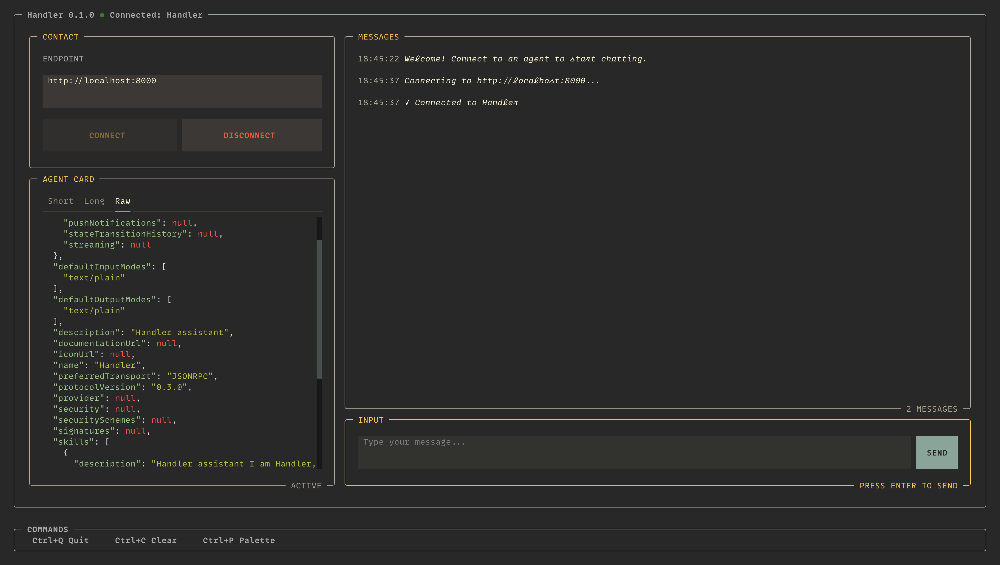

# Handler

[](https://github.com/alDuncanson/handler/actions/workflows/ci.yml)

Handler is an A2A protocol client TUI and CLI.



## Run

```bash
uvx git+https://github.com/alDuncanson/handler -- tui
```

## Install
```bash
uv tool install git+https://github.com/alDuncanson/handler
```

## Use

If you don't have an A2A server to connect to, Handler provides a reference implementation of an A2A server:

```bash
handler server
```

### TUI

Interactive terminal user interface:

```bash
handler tui
```

### CLI

Fetch agent card from A2A server:

```bash
handler card http://localhost:8000
```

Send a message to an A2A agent:

```bash
handler send http://localhost:8000 "Hello World"
```

## Contributing

See [CONTRIBUTING.md](CONTRIBUTING.md) for architecture and development instructions.
